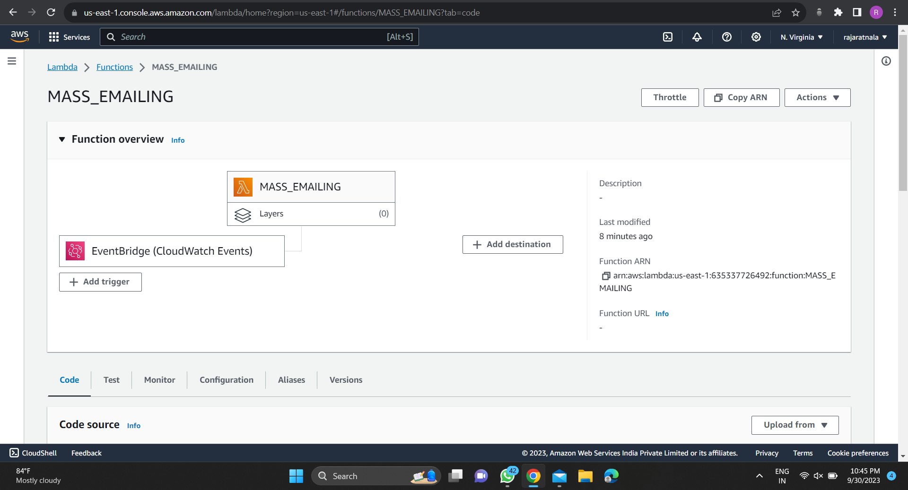
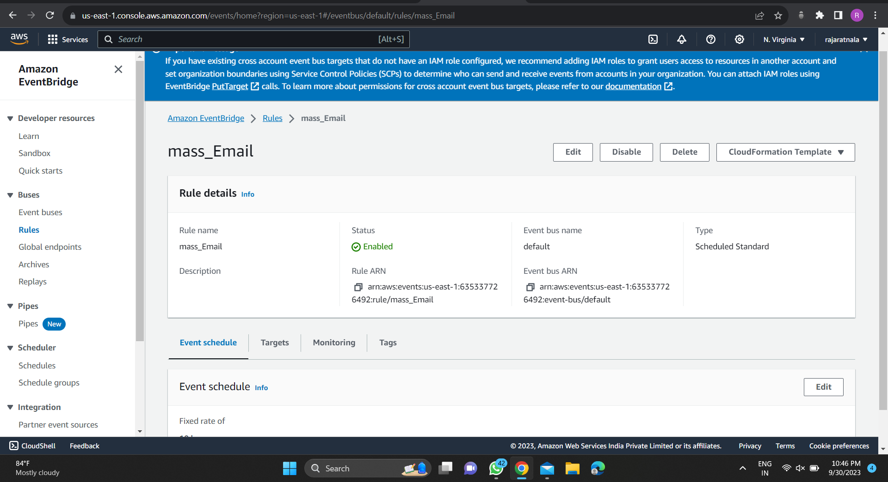
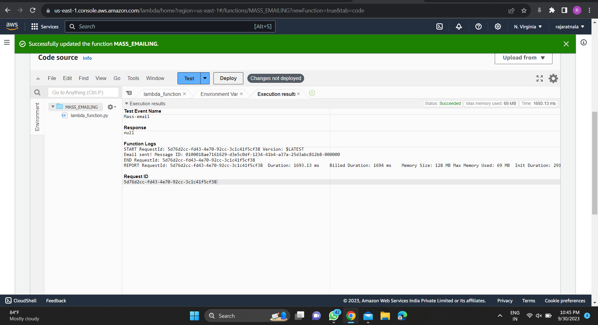
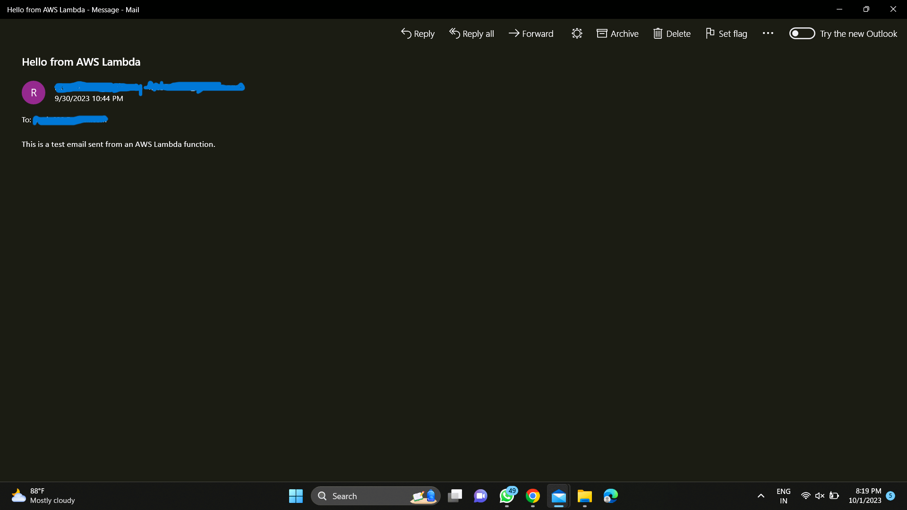

# AWS-AUTOMATE_Mini-Project

Automate Emailing in AWS is a repository that demonstrates how to send automated emails using AWS services. This project provides a step-by-step guide and code samples to help you set up email automation in your AWS environment.

## Table of Contents

- [Introduction](#introduction)
- [Prerequisites](#prerequisites)
- [Setup](#setup)
- [Usage](#usage)
- [Contributing](#contributing)
- [License](#license)

## Introduction

Sending emails programmatically can be a crucial part of various applications and workflows. This repository aims to simplify the process by utilizing AWS services like Amazon SES (Simple Email Service) and Lambda to automate email sending. Whether you want to send notifications, alerts, or reports via email, this project provides a foundation for you to get started.

## Prerequisites

Before you begin, ensure you have the following prerequisites in place:

- An AWS account with appropriate permissions.
- AWS CLI installed and configured with your AWS credentials.
- Basic knowledge of AWS services like SES, Lambda, and IAM.
- Python and required dependencies if you plan to use Python scripts.

## Setup

Follow these steps to set up email automation in AWS:

1. **Clone the Repository:**

git clone https://github.com/RatnalaRaja/AWS-AUTOMATE_Mini-Project.git

cd AWS-AUTOMATE_Mini-Project

2. **Configuration:**

Configure AWS CLI with your credentials if you haven't already:

3. **AWS Resources:**

Create necessary AWS resources like SES, Lambda functions, and IAM roles using the provided CloudFormation templates or manually configure them as described in the documentation.

4. **Customize Email Templates:**

Customize email templates in the `templates/` directory to match your use case and branding.

5. **Deploy Lambda Functions:**
<h3>Deploy Lambda functions that trigger email sending based on your application's logic.</h3>

<h3>Triggering through AWS EVENTBRIDGE.</h3>

6. **Test:**

Test the email automation setup to ensure emails are sent successfully.

## Usage

Once the setup is complete, you can start using the email automation in your AWS environment. Here are some common use cases:

- **Sending Alerts:** Configure Lambda functions to send alerts based on CloudWatch alarms or application events.

- **Sending Reports:** Automate the delivery of reports generated by your application or services.

- **Notification Service:** Use this project as a notification service to keep users or administrators informed about important events.

Please refer to the documentation and code samples for more details on how to integrate and use email automation in your specific scenario.

## Contributing

Contributions to this project are welcome! If you have improvements, bug fixes, or new features to suggest, please open an issue or submit a pull request. Make sure to follow the [contributing guidelines](CONTRIBUTING.md).

## License

This project is licensed under the [MIT License](LICENSE). You are free to use, modify, and distribute this project as per the terms of the license.

---

**Disclaimer:** This project is for educational and demonstration purposes. Be mindful of AWS costs when deploying resources and consider best practices for security and privacy when handling email data.
